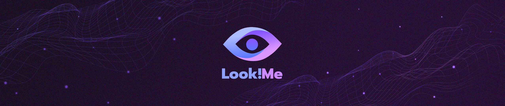

<h1 align="center">Look!Me</h1>
<p align="center">Decentralized digital rights management application</p>

----

# Demo

The application demo is availble **[here](http://test1.ksn.by)**
> *Warning! To use the application you need to have a web3 browser installed (**[Metamask](https://metamask.io/)** recommended)*

# Usage

- The **Look!Me** application is for the content access rights selling (software, media, etc.). The payment instrument is a **[ERC-20](https://en.wikipedia.org/wiki/ERC-20)** token, specified by the application owner. Each content access right has a usage time. When the right usage time ends, the user cannot access the specified content
- The user can view the content sold by the application owner in the web interface, where the each asset price specified in the chosen by the application owner **[ERC-20](https://en.wikipedia.org/wiki/ERC-20)** tokens
- After the content was selected, the user can press the **BUY** button. It'll send two transactions to the **[Ethereum](https://ethereum.org/)** Blockchain, each of them should be approved by the user. The first transaction allows the smart contract to spend amount of the tokens, needed to buy the specified content. The second transaction exchanges owned by the user **[ERC-20](https://en.wikipedia.org/wiki/ERC-20)** tokens to the **[ERC-721](http://erc721.org/)** content access token
- To buy the specified content access token user need to have the **[ERC-20](https://en.wikipedia.org/wiki/ERC-20)** tokens amount on its ethereum-address (crypto-wallet), needed to buy the specified content access right
- After some time (determined by the current **[Ethereum](https://ethereum.org/)** block difficulty) the access token will appear in the user personal cabinet, with a remaining time indication
- So the user can buy the other content access tokens - information about all of them (label of the content to wich access is granted and remaining time) will be shown in the user personal cabinet

# Install

To run the project locally the following dependencies required:

- **[Git](https://git-scm.com/)** or **[Git GUI client](https://git-scm.com/download/gui/windows)**
- **[Node.js](https://nodejs.org/)** v10.0.0 or newer
- **[npm](https://www.npmjs.com/)**

> *If you have a Git GUI client installed you can clone the repository through its interface*

```shell
# clone the repository
git clone https://github.com/aviacore/ddrm

# install the project dependencies
cd ddrm
npm i
```

# Run

> *Warning! To run the application you need to have a web3 browser installed (**[Metamask](https://metamask.io/)** recommended)*

```shell
# start the ganache
npm run chain

# deploy smart contracts to the testrpc
npm run migrate

# start the development server
npm run start
```

# Test

```shell
# start the ganache
npm run chain

# run the test script
npm run test:sol
```

# Scripts

List of all scripts names <br />
Run them by typing `npm run <script>` in terminal, where `<script>` is a name of the script to run

script name   | description
:------------:|:-----------:
`build`       | builds the whole application
`build:js`    | builds the web application
`build:sol`   | builds the smart contracts
`chain`       | starts the testrpc (ganache-cli)
`console`     | launchs the truffle console (with configured web3.js and deployed contracts instances)
`lint`        | lints all files
`lint:fix`    | lints all files and fixes code style problems
`lint:js`     | lints js files
`lint:js:fix` | lints js files and fixes js code style problems
`lint:sol`    | lints solidity files
`lint:sol:fix`| lints solidity files and fixes solidity code style problems
`migrate`     | deploys smart contracts to the testrpc (ganache-cli)
`start`       | builds web application and starts the development server on <http://localhost:3000>
`test`        | runs all tests
`test:js`     | runs js tests
`test:sol`    | runs solidity tests

# License

**Look!Me** is released under the **[MIT License](https://github.com/aviacore/ddrm/blob/master/LICENSE)**, © Kornilov S.N., 2018
